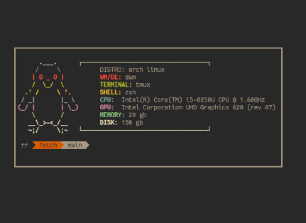

<h1 align="center">fetch</h1>
<h4 align="center">Fetch system information in terminal</h4>
<div align="center"></div>

---

## Table of content

- [Description](#description)
- [Setup](#setup)
- [Usage](#usage)
- [License](#license)

# Description

Fetch is a system information tool design to operate in the command-line interface and created using Golang.
It's primary function is to present information about your hardware, software, and operating system in an
aesthetically pleasing manner.

While there are other diagnostic tools available for system statistics, Fetch emphazises speed, simplicity
and visual appeal to be used for creating system screenshots that other users may want to view. This project
is currently in its early development stage, and user feedback and contributions are highly appreciated and valued.

# Setup
> [Install](https://go.dev/doc/install) Go if you don't have it.

1. Clone this repo :
```bash
git clone github.com/the01rch/fetch
```
2. Go to the directory :
```bash
cd fetch
```
3. Build and install it with :
```bash
sudo make install
 ```

# Usage

```bash
fetch
```

# License

[MIT](https://github.com/the01rch/fetch/blob/main/LICENSE.md)
